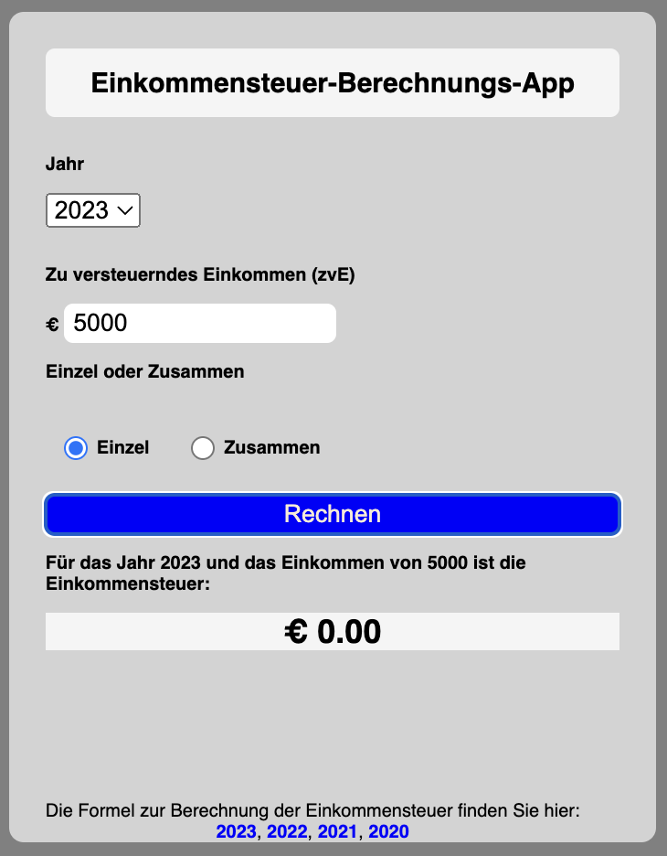
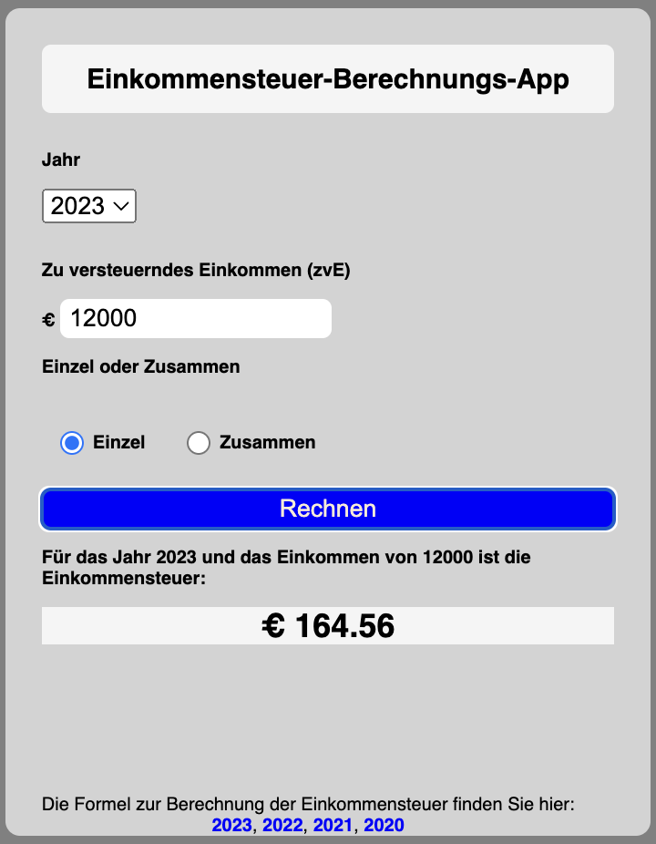
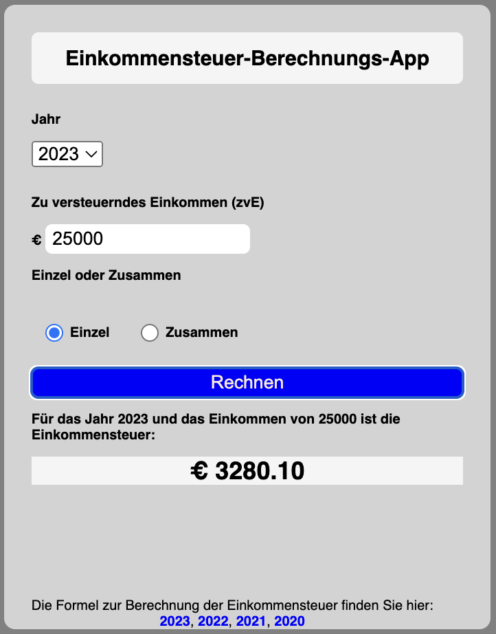
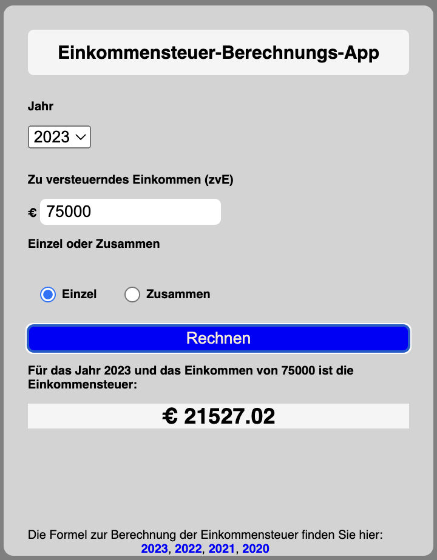
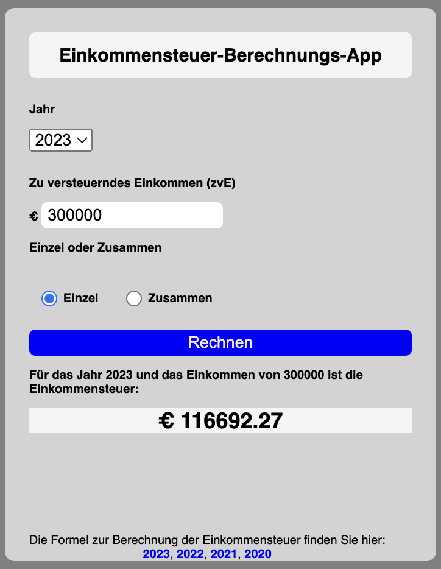
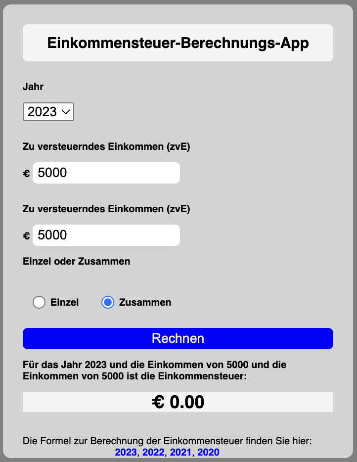
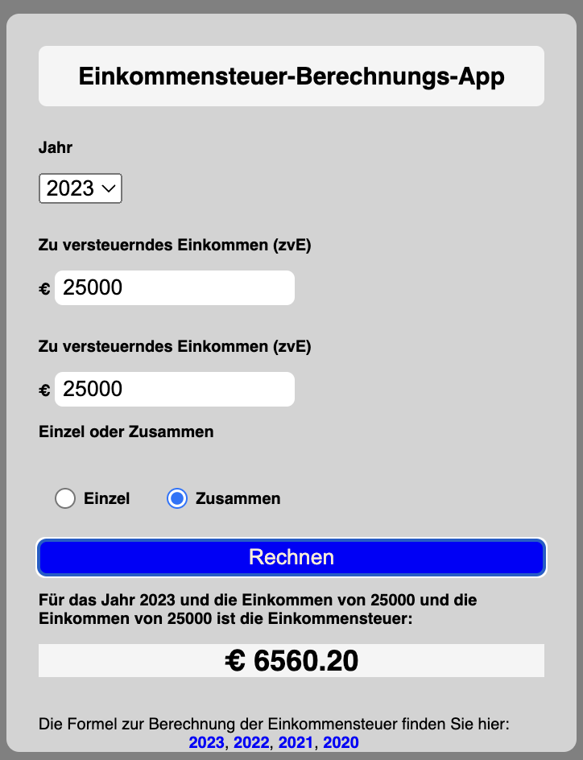
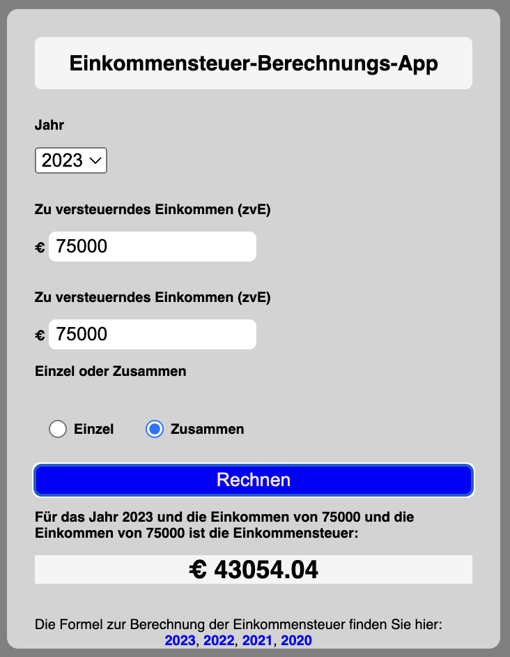
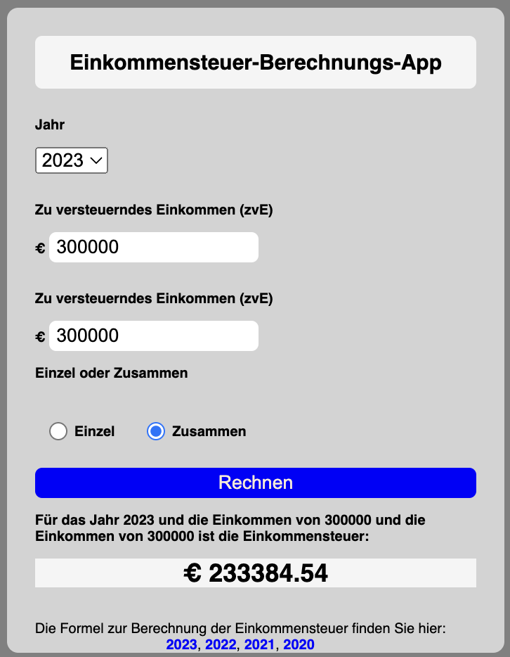

# income-tax-calculation

# [Deployment](https://mariariosnavarro.github.io/income-tax-calculation/)

The formulas I have used are here:

- [2023](https://www.finanz-tools.de/einkommensteuer/berechnung-formeln/2023)
- [2022](https://www.finanz-tools.de/einkommensteuer/berechnung-formeln/2022)
- [2021](https://link-url-here.org)
- [2022](https://link-url-here.org)

<div>


</div>

<div>







</div>

<div>






</div>

##

# TEST

Values are rounded in the Output, here the exact Values to test.

# 2023

- case1 : 5000/ year 2023

```
tax=0
```

- case2: 12000/ year 2023

```
y = (12000 - 10908)/10000 = 0.1092
tax = (979.18 _ y + 1400) _ y = 164.556369
```

- case3: 25000/ year 2023

```
z= (25000 -15999)/10000 =0.9001
tax = (192.59*z + 2397)*z + 966.53 =3280.10226813
```

- case4: 75000/ year 2023

```
tax = 0.42 * 75000 -9972.98 = 21527.02
```

- case5: 300000/ year 2023

```
tax = 0.45 * 300000 -18307.73 = 116692.27
```

# 2022

- case1 : 5000/ year 2022

```
tax=0
```

- case2: 12000/ year 2022

```
y = (12000 - 10347)/10000 = 0.1653
tax = (1088.67 _ y + 1400) _ y =261.166917
```

- case3: 25000/ year 2022

```
z= (25000 -14926)/10000 = 1,0074
tax = (206.43*z + 2397)*z + 869.32 = 3.493,55427
```

- case4: 75000/ year 2022

```
tax = 0.42 * 75000 -9336.45 = 22163,55
```

- case5: 300000/ year 2022

```
tax = 0.45 * 300000 -17671.20 = 117328.8
```

# 2021

- case1 : 5000/ year 2021

```
tax = 0
```

- case2: 12000/ year 2021

```
y = (12000 - 9744)/10000 =0,2256
tax = (995.21 _ y + 1400) _ y = 366,49
```

- case3: 25000/ year 2021

```
z = (25000 -14753)/10000 = 1.0247
tax = (208.85*z + 2397)*z + 950.96 = 3626,46051
```

- case4: 75000/ year 2021

```
tax = 0.42 \* 75000 -9136.63 = 22363,37
```

- case5: 300000/ year 2021

```
tax = 0.45 \* 300000 -17374.99 = 117625.01
```

# 2020

- case1 : 5000/ year 2020

```
tax=0
```

- case2: 15000/ year 2020

```
y = (12000 - 9408)/10000 = 0.2592
tax = (972.87 _ y + 1400) _ y = 428.241921
```

- case3: 25000/ year 2020

```
z = (25000 -14532)/10000 =1.0468
tax = (212.02*z + 2397)*z + 972.79 = 3714,29905
```

- case4: 75000/ year 2020

```
tax = 0.42 * 75000 -8963.74 = 22536,26
```

- case5: 300000/ year 2020

```
tax = 0.45 * 300000 -17078.74 = 117921,26
```
